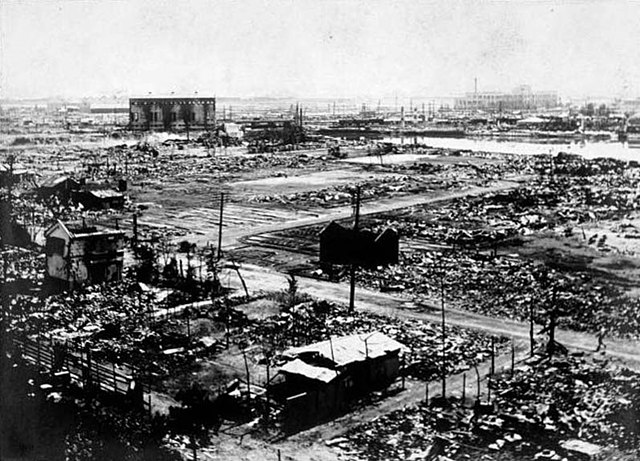
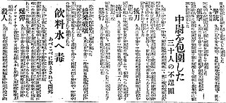

# Fake News

## written by [Ukichiro Nakaya](https://www.aozora.gr.jp/cards/001569/files/53207_49830.html) and [Torahiko Terada](https://www.aozora.gr.jp/cards/000042/files/43260_17028.html)

### 1. Ukichiro Nakaya wrote in 1945:

On August 24th, at midnight, I voyaged to the main island by the last ferry,
after which the ferry was supposed to halt for a while.

The ferry was full of returnees from Sakhalin.
On the cold deck, they slept in a cluster.
At Aomori, I got on the Tohoku Line train which was crowded more than the ferry.
Jam-packed day and night, I finally arrived at Tokyo.

Tokyo was utterly calm.
But the return train was much more crowded with repatriates.
What I gained from this difficult trip in about two weeks
was a feeling that fake informations spread all over Japan.
I felt that this trip to Tokyo was very meaningful,
because I got a conviction that every rumor can safely be
regarded as a fake, unless I witness it in my eyes.

Before leaving for the trip, I visited a certain village in Hokkaido on business.
There spread a rumor that Tokyo was in chaos, and I was told that I was going to hell.
When I got to Tokyo, it was the calmest city.
On my returning to Hokkaido, a friend of mine, who was an officer in the ministry of engineering,
was going to accompany me on business. 
He went to the Ueno station to buy a ticket.
But he couldn't buy it, even though he showed a certificate of the ministry.
He said that they didn't sell tickets because
seven thousand people were stuck in the Aomori station.
I had a return ticket, so I went alone.
At Aomori, not a passenger was left unloaded on the ferry.

It is completely wrong to assume that
fake news is amplified by uneducated peasants and laborers.
When the great earthquake destroyed Tokyo in 1923, I got the same feeling as I wrote above.
It was unfortunate that a rumor about lawless Koreans spread after the earthquake.
At that time my family and I lived in Ueno.
We were burned out by the fire which was caused by the earthquake,
and we took refuge in my friend's house in Hongo.
Even after the fire died out, the rumor didn't disappear.
On the third morning after the earthquake, I went out to the hilltop of Sakana-machi town in Komagome.
On the road there was a crowd of people with worried looks.
Riding a horse, a policeman came running uphill through the crowd.
The policeman stopped at the hilltop, and shouted aloud:
"Now we are at war with them on the Rokugo riverbanks.
They possibly cross the river. You should be ready for the war."
So shouting, he went downhill away.
I can still remember this scene clearly, though it was more than twenty years ago.
Of course the war was a groundless rumor.

If a rumor sounds like a nonsense,
then it is certainly a fake, no matter how reliable its source is.
It is a pity that few people can deny a rumor which comes from a reliable source.

On August 16th, an alarming sound of a phone call awoke me at midnight.
My wife looked pale, saying "it sounds like an urgency, so please answer the phone right now."
The phone informed me of a really urgent situation.
It told me to burn important documents on wartime research immediately,
because twenty thousand soldiers from the Soviet Union landed in Otaru.
It also told me that my colleagues had already gathered because of an emergency summons.
When I was awoken, I had just fallen asleep in exhaustion.
So I was really displeased by the phone call.
How many days does it take for twenty thousand soldiers to land in Otaru?
Considering the equipments in the port of Otaru, it is impossible to land in a day or two.
Until the evening, there was nothing unusual. 
Therefore, twenty thousand soldiers appeared in three or four hours. 
They must be soldiers of the Arabian Nights. So guessing, I went to bed again.
About an hour later, I got another phone call which said "the previous information was a fake."

I heard that there were a lot of similar cases in Tokyo too.
A few days after the end of the Pacific War, in a certain ward of Tokyo,
there was circulated a notice that stated: "American soldiers come here tonight.
Hang out a flag of America, and prepare dinners for them."
I heard about this case from a chief of a certain institute.
On reading the notice, a young lady, who was a wife of a staff in the institute,
came there in a hurry to tell her husband about the notice.
The chief said to the lady that the notice made no sense and must be a fake.
He asked her whether she had inquired of the police about the notice.
She replied that she hadn't inquired yet.
He inquired by telephone, and found that it was a fake, as he anticipated.
The chief preached to staffs of the institute: "You are among the elite who build Japan.
You must be able to deny such a rumor right away."

Fake news would never spread if everyone could deny a nonsense rumor.
But, in order to deny it confidently, one has to have his or her own thoughts.
Although this doesn't seem difficult, it actually is.
Particularly it is getting more difficult in recent years,
because of such a trend as to slight processes and discussions.

To reconstruct postwar Japan scientifically, we must stop spreading fake news.
When we can stop it, the reconstruction may be half achieved.

### 2. Torahiko Terada wrote in 1924:

Fill a long tube with a mixture of hydrogen and oxygen gases in an appropriate proportion.
Emit an electrical spark in the gas near one end of the tube.
Then the spark ignites the gas, and the combustion starts to propagate through the tube.
The speed of the propagation increases abruptly, until it becomes so called a detonation wave.
This phenomenon is well known.

However, if the proportion of hydrogen is either too small or too large,
then the spark doesn't ignite the gas.
Although some chemical reaction takes place near the spark,
the reaction is confined in its vicinity and doesn't propagate around.

Formally, the spread of fake news is somewhat similar to 
the propagation of combustion as described above.

Fake news wouldn't come about if it were not for its source that corresponds to the igniting spark.
Also fake news wouldn't spread if it were not for a medium that plays the role of the combustible gas.
Without a medium, fake news would die on the spot of its ignition.

Thus, if fake news spreads over the city of Tokyo on some occasion,
then its citizens themselves must take at least half responsibility.
Depending on cases, their responsibility may be higher than ninety percent.
This is because: (1) the ignition of a rumor is a natural phenomenon which
happens everywhere with or without intention, so (2) the ignition is almost inevitable,
and (3) the spread is mediated by citizens.

Suppose that someone in some city said a rumor 
"there will be a big earthquake at three o'clock tonight."
Such a rumor would rot away if, say, thirty percent of seniors in the city
knew the fact that an accurate prediction of an earthquake is currently impossible.
By contraposition, if the rumor wouldn't rot away, then most of the citizens
should be ignorant of this fact.

Last year we had a huge earthquake, and the subsequent fire burned Tokyo to ashes.
During the fire, there spread a rumor that a mob of Koreans was going to pour poison in wells,
and throw bombs into tall buildings.
On this occasion, what if most of the citizens of Tokyo had thought as follows?

Suppose that they poured poison in, say, ten percent of wells in Tokyo city.
Also suppose that the concentration of the poison was high enough
to kill or torture those who drink water of the wells.
How much amount of poison did they need?
To answer this question correctly, one has to estimate such quantities as,
the gross number of wells in Tokyo city, the amount of water in a well on the average,
the amount of water which a person drinks in a day on the average,
and a lethal dose which depends on the kind of the poison.
But such a detailed estimate is unnecessary.
With a little scientific knowledge, a rough estimate is sufficient 
to see that they needed a vast amount of poison.
Anyway, the mob must have had a fairly large stock of poison before the earthquake.
This may not be impossible, but is a little strange.

Suppose that they had a large stock of poison.
Then their tasks must have been very hard.
The mob must organize hundreds or thousands of members
to be dispatched around in the city.
It must take long hours to hand poison to all of them.
Suppose that they took long hours to do it.
Each member must carry a drum of poison on his back, and walk around to find the well.
They must pour poison without being seen.
Before pouring, they must measure the height of water in the well
to adjust the proper amount of poison.
Then they must stir the water so that the poison would dissolve in it.
Imagine how hard their tasks had been.

These thoughts might somewhat reduce, if not erase, the fear of the rumor about poison.

The same is true of the rumor about bombs.
Count the number of bombs and bombers that were necessary
to blast tall buildings in Tokyo city.
At least the working-class people who lived in the uptown
didn't have to worry about blasting of their tenement houses.

One may object that, in case of disaster, one could not afford to do such cool math.
Right objection. But this objection just admits that the citizens lacked in
practical scientific knowledge, doesn't it?

I don't think that scientific knowledge is, for example, 
to memorize the distance to Uranus or to know various kinds of vitamins.
Rather I hope that scientific knowledge be a useful criterion of judgement in everyday life.

Common sense often leads us to wrong judgements.
More often scientific knowledge does so.
However, if properly exercised, scientific knowledge 
provides us with "opportunity and courage to reflect on matters objectively."
In a city where citizens were accustomed to such reflections,
the propagation of fake news should be decelerated.
Even if reflections resulted in wrong judgement and failed to stop the propagation,
those citizens who reflected might not at least bring disgrace on themselves.

